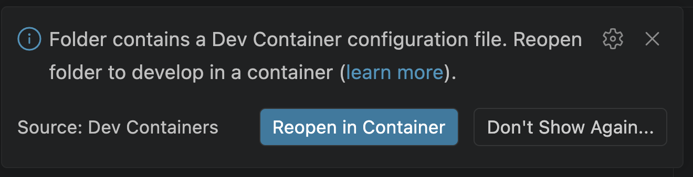
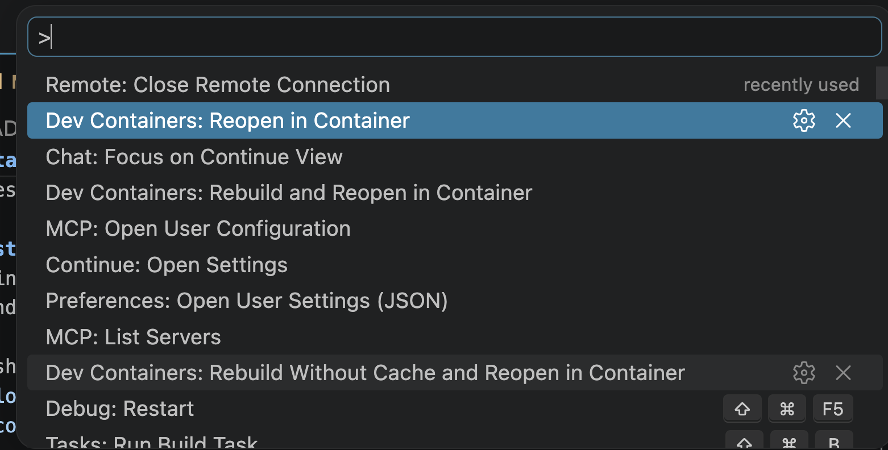

# Currency converter
This application is a small proof-of-concept currency converter that allows the
user to do basic currency convertions with current rates.


# Installation
This is a Node-based project, and therefore the following is required:
* Node version +20
* Linux/Unix (Mac)

For convenience, you can also run this project in Docker, at which point, Docker
becomes the only system requirement.

## Installation (with Docker)
If using this application, this application as simple as running the following
commands:

```bash
git clone https://github.com/Laurianne-M/convertor.git
code convertor
```

Once you are in VS Code, it **should** pick up the `devcontainer.json` and
automatically propose reopenning it in a container.



If the IDE does not propose this, you can always use the keyboard shortcut
`CTRL/CMD + SHIFT + P`, and click "Reopen in Container":



At this point the IDE will automatically build and configure the development
container.

## Installation (without Docker)
The installation steps are still relatively simple. Just make sure that you have
Node +20 installed beforehand.

```bash
git clone https://github.com/Laurianne-M/convertor.git
code convertor
cd src/web
make install
```