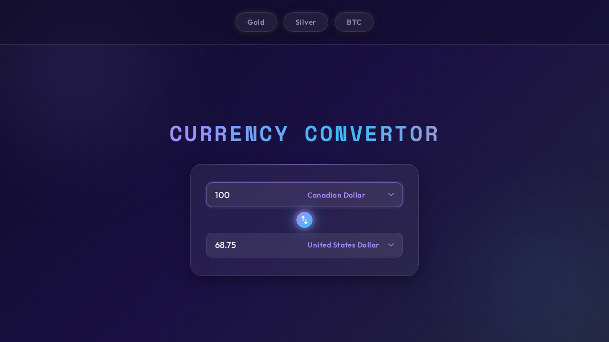

# Currency converter
This application is a small proof-of-concept currency converter that allows the
user to do basic currency convertions with current rates.



## Repository Structure
* `src/web`: The frontend user interface application.
* `src/api`: The backend API services for rates and conversion logic.

# Installation
This is a Node-based project, and therefore the following is required:
* Node version +20
* Linux/Unix (Mac)

For convenience, you can also run this project in Docker, at which point, Docker
becomes the only system requirement.

## Installation (with Docker)
If using this application, this application as simple as running the following
commands:

```bash
git clone https://github.com/Laurianne-M/convertor.git
code convertor
```

Once you are in VS Code, it **should** pick up the `devcontainer.json` and
automatically propose reopenning it in a container.


If the IDE does not propose this, you can always use the keyboard shortcut
`CTRL/CMD + SHIFT + P`, and click "Reopen in Container":


At this point the IDE will automatically build and configure the development
container.

## Installation (without Docker)
The installation steps are still relatively simple. Just make sure that you have
Node +20 installed beforehand.

```bash
git clone https://github.com/Laurianne-M/convertor.git
code convertor

### Web Frontend (`src/web`)
```bash
make -C src/web install

### API Backend (`src/api`)
```bash
make -C src/api install
```
---

## Environment Setup

This project uses environment-based configuration to manage secrets securely across the frontend web client and backend services.

### 1. Configuration Overview

| Layer | File Path | Required Variable Prefix | Runtime Syntax |
| :--- | :--- | :--- | :--- |
| **Web Frontend (Vite)** | `/.env` (Workspace Root) | `VITE_` | `import.meta.env.VITE_...` |
| **API Backend (Express)** | `/src/api/.env` | None | `process.env....` |

> **Security Note:** `.env` files contain sensitive API credentials and **must never be committed to Git**. Ensure both `.env` and `src/api/.env` are listed in your `.gitignore`.

### 2. Client-Side Configuration (/.env)

Create a .env file in the project root directory: 

```bash
# Workspace Root /.env
VITE_EXCHANGE_RATES_API_KEY=your_actual_api_key
```

Because the frontend project resides in `src/web/`, Vite relies on `envDir` inside `src/web/vite.config.ts` to locate the workspace root `.env` file:

```bash
// src/web/vite.config.ts
import { defineConfig } from 'vite';
import path from 'path';

export default defineConfig({
  envDir: path.resolve(__dirname, '../../'),
  ...
});
```

Accessing in Frontend TypeScript Code:

```bash
# /src/api/.env
const apiKey = import.meta.env.VITE_EXCHANGE_RATES_API_KEY;
```

3. Server-Side Configuration (/src/api/.env)